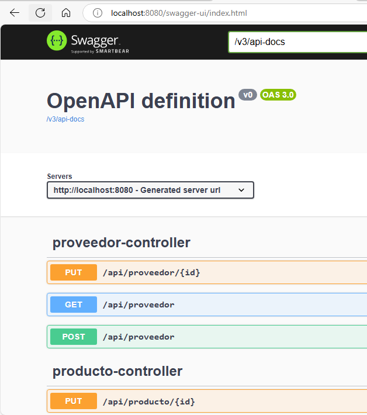

# BackOffice SOLID

Proyecto backend para venta

## 1. Utilitarios

-  Chocolatey: nos facilitará la instalación de las diferentes aplicaciones que utilizaremos y se puede instalar desde powershell en modo administrador con una simple linea de comando

   ```powershell
   Set-ExecutionPolicy Bypass -Scope Process -Force; [System.Net.ServicePointManager]::SecurityProtocol = [System.Net.ServicePointManager]::SecurityProtocol -bor 3072; iex ((New-Object System.Net.WebClient).DownloadString('https://community.chocolatey.org/install.ps1'))
   ```

-  Terminal: es una consola de windows que facilita el uso de comandos cmd, powershell, etc, se puede instalar desde chocolatey

   ```bash
   choco install microsoft-windows-terminal -y
   ```

-  Powershell 7.4.5: puede usar chocolatey para instalarlo con este comando
   ```bash
    choco install powershell-core --version=7.4.5 -y
   ```

## 2. Requisitos

-  jdk 21 ([configurar variables de entorno PATH y JAVA_HOME](https://www.aprenderaprogramar.com/index.php?option=com_content&view=article&id=389:configurar-java-en-windows-variables-de-entorno-javahome-y-path-cu00610b&catid=68&Itemid=188)) También puede instalarlo utilizando chocolatey, lo cual facilitará la configuración del PATH y el JAVA_HOME porque se configura automáticamente

   ```shell
   choco install openjdk --version=21.0.0
   ```

-  git: Puede usar chocolatey para instalarlo con este comando

   ```bash
   choco install git -y
   ```

-  Apache Maven 3.9.9 ([configurar variables de entorno](https://dev.to/vanessa_corredor/instalar-manualmente-maven-en-windows-10-50pb)) También puede instalarse desde chocolatey, lo cual facilitará la configuración automática del path

   ```bash
   choco install maven -y
   ```

-  [mariadb:10.3](https://community.chocolatey.org/packages/mariadb/10.3.16) también puede instalarse usando chocolatey, lo que nos facilitará una instalación ideal para desarrollo, con un usuario por defecto `root` y sin contraseña sobre el puerto `3306`, a su vez que instalará automáticamente el cliente `HeidiSQL`, todo esto usando el comando

   ```bash
   choco install mariadb --version=10.3.16 -y
   ```

-  [NSSM](https://community.chocolatey.org/packages/NSSM) se puede instalar usando Chocolatey

   ```bash
   choco install nssm -y
   ```

### 2.1. Instalación Inicial

-  Asegurarse de tener instalado el JDK de [java](https://www.aprenderaprogramar.com/index.php?option=com_content&view=article&id=389:configurar-java-en-windows-variables-de-entorno-javahome-y-path-cu00610b&catid=68&Itemid=188) en su versión 21, sin olvidarse de configurar el PATH y el JAVA_HOME correctamente

-  Asegurarse de tener instalado [maven](https://dev.to/vanessa_corredor/instalar-manualmente-maven-en-windows-10-50pb) correctamente y configurar el PATH del sistema operativo para que se pueda ejecutar maven desde consola
-  Configurar el gestor de base de datos [mariadb](https://community.chocolatey.org/packages/mariadb/10.3.16), para este es necesario tomar en cuenta el puerto y host en que utiliza para configurarlo como parámetros en el pipeline bajo los parámetros `DB_HOST` y `DB_PORT`, el nombre de la base de datos es configurable bajo el nombre de parámetro `DB_DATA_BASE` aunque es opcional crear la base de datos, caso contrario se crea automáticamente, finalmente es importante configurar configurar correctamente el nombre de usuario y password para el gestor de base de datos, bajo el parámetro `DB_USERNAME` y `DB_PASSWORD`
-  Es necesario aclarar el puerto que utilizara el frontend `FRONTEND_PORT` y `FRONTEND_HOST` para configurar el CORS en Spring Boot, que limitara desde donde se puede consumir la API
-  Es necesario tener instalado [NSSM](https://community.chocolatey.org/packages/NSSM) (se puede instalar usando Chocolatey) que nos ayudará a exponer el archivo jar generado por al empaquetar el proyecto, para exponerlo como servicio de windows.
-  Finalmente es necesario definir en `JAR_LOCATION` a partir de qué ruta se trabajará para crear el servicio de windows con el que se expondrá el API

## 3. Verificación de la ejecución del Pipeline

Para el Backend puede comprobar que esta funcionando correctamente, accediendo al [Swagger del API](http://localhost:8080/swagger-ui/index.html) corrigiendo el puerto de 8080 al puerto que le ha asignado



### 3.1 Manejo del Servicio

La app deberá quedar instalada como servicio de windows `solid` y debe iniciarse por si solo, en caso no se inicie, intentar con

```bash
net start solid
```

También puede detener el servicio usando el comando

```bash
net stop solid
```
